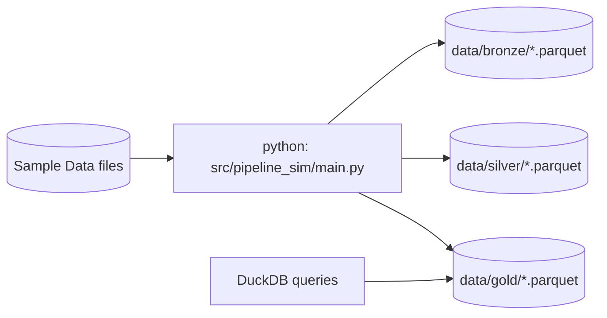

# Traffic Lane Management System (TLMS) — Data Engineering Portfolio

> **Portfolio repo** showcasing the end‑to‑end data engineering design for a Traffic Lane Management System focused on Maryland corridors. It includes source mappings, zone design (Bronze/Silver/Gold), transformation logic, sample data, and a local simulator (DuckDB + Parquet) so anyone can run the pipeline without AWS costs.

## Why this repo
- Demonstrates **real-world architecture** deployed on AWS (S3 + Glue Catalog + Athena + Lambda + Kinesis/Firehose + Lake Formation).  
- Runs **locally** with a lightweight simulator (DuckDB/Pandas/Parquet) using **synthetic samples** that mirror our sources (MDOT SHA AADT, CHART Incidents/Events, CHART RWIS, WZDx Work Zones).  
- Clean: clear docs, tests, CI, and diagrams.

---

## Architecture (target on AWS)

```mermaid
flowchart LR
  subgraph Sources
    AADT[(MDOT SHA AADT CSV)]
    CHARTI[(CHART Incidents JSON)]
    RWIS[(CHART RWIS Sensors JSON)]
    WZDX[(WZDx GeoJSON)]
  end

  subgraph Ingestion
    K[Kinesis/Firehose (streaming)]
    L[Lambda (batch/stream ETL)]
  end

  subgraph Lake[S3 Data Lake]
    B[(Bronze - raw)]
    S[(Silver - validated/curated)]
    G[(Gold - analytics-ready)]
  end

  subgraph Meta[Glue & Lake Formation]
    C[(Glue Catalog)]
    P[(Lake Formation Policies)]
  end

  subgraph Query
    Q[Athena/Trino SQL]
    BI[Dashboards/Notebooks]
  end

  AADT -->|batch| L --> B
  CHARTI -->|API pull| L --> B
  RWIS -->|API/JSON| L --> B
  WZDX -->|GeoJSON| L --> B

  B -->|schema checks, normalization| S -->|denormalize, star schema| G
  C --- B
  C --- S
  C --- G
  P --- C
  Q --> G
  Q --> S
  BI --> Q
```

---

## Local Simulator (what runs now)



**Run locally** to produce Parquet datasets across zones and query them with DuckDB—no AWS account required.

---

## Data Sources (mirrored with synthetic samples)

- **MDOT SHA AADT** (traffic counts by segment; CSV‑like)  
- **CHART Incidents/Events** (JSON)  
- **CHART RWIS Sensors** (JSON; weather/pavement conditions)  
- **WZDx Work Zones** (GeoJSON RFC 7946)

See `docs/source_mappings.md` for schema mapping and `docs/contracts/` for data contracts (Pydantic models).

---

## Quickstart

```bash
# 1) Create & activate a virtual environment (suggested)
python -m venv .venv
source .venv/bin/activate  # Windows: .venv\Scripts\activate

# 2) Install deps
pip install -r requirements.txt

# 3) Run the local simulator
make run        # or: python -m src.pipeline_sim.main

# 4) Query gold data
python -m src.pipeline_sim.ducksql "SELECT * FROM 'data/gold/fact_traffic_events.parquet' LIMIT 5;"

# 5) Run tests & lint
make test
make lint
```

Expected outputs are written under `data/bronze`, `data/silver`, and `data/gold` as Parquet.  

---

## Repository Layout

```
.
├─ src/
│  └─ pipeline_sim/
│     ├─ main.py                # pipeline runner: bronze→silver→gold
│     ├─ transforms.py          # row validation & normalization
│     ├─ schemas.py             # Pydantic data contracts
│     ├─ ducksql.py             # quick DuckDB CLI for queries
│     └─ __init__.py
├─ data/
│  ├─ samples/                  # synthetic samples for each source
│  ├─ bronze/                   # generated
│  ├─ silver/                   # generated
│  └─ gold/                     # generated
├─ docs/
│  ├─ source_mappings.md        # source→bronze→silver→gold mapping tables
│  ├─ zones.md                  # zone definitions & validation rules
│  ├─ governance.md             # data governance: lineage, security
│  └─ contracts/
│     ├─ chart_incident.json    # example JSON schema contract
│     ├─ rwis_observation.json
│     └─ wzdx_feature.json
├─ diagrams/
│  └─ architecture.mmd          # Mermaid source for architecture
├─ tests/
│  └─ test_transforms.py        # unit tests for core transforms
├─ .github/workflows/ci.yml     # lint + tests
├─ requirements.txt
├─ Makefile
├─ LICENSE
└─ CONTRIBUTING.md
```


## Credits / Context
Built from coursework in Morgan State University’s **MS in Data Analytics** program (Data Engineering Capstone). Designed for portfolio use.
